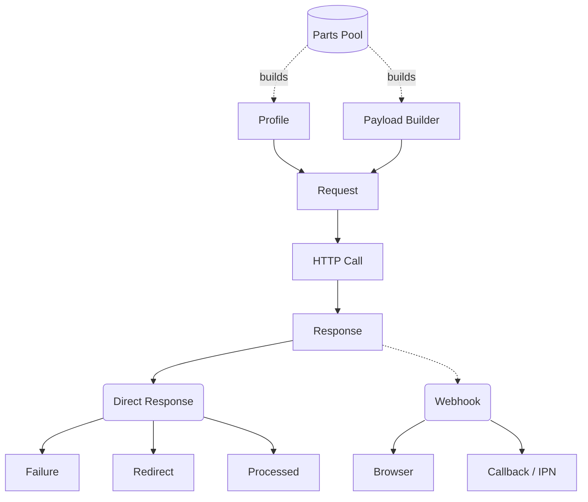

# PayTabs PHP SDK Architecture

This document reflects the current architecture of the SDK in version 3.x.
Think of the SDK as LEGO blocks.

## Building Blocks

1. **Parts:**
Atomic request fragments that implement [src/Request/Payload/PartInterface.php](src/Request/Payload/PartInterface.php). A part contributes body, headers, query, or path fields through build logic.

2. **Payloads and Builders:**
Payload builders compose many parts into final request payload objects.
- Builder contracts and base classes are in [src/Request/Payload](src/Request/Payload).
- Concrete payload builders are created by [src/Request/Payload/PayloadsFactory.php](src/Request/Payload/PayloadsFactory.php).

3. **Profile:**
Profile carries endpoint context and credentials, and contributes request-level defaults.
- Profile model: [src/Profile/Profile.php](src/Profile/Profile.php)
- Region-aware profile factory: [src/Profile/ProfilesFactory.php](src/Profile/ProfilesFactory.php)

4. **Request:**
Request combines Profile + Payload builder + endpoint path into a transport-ready shape.
- Base request behavior: [src/Request/AbstractRequest.php](src/Request/AbstractRequest.php)
- Request factory: [src/Request/RequestsFactory.php](src/Request/RequestsFactory.php)

5. **Response:**
Responses are handled through two branches.
- Direct responses: [src/Response/AbstractResponseDirect.php](src/Response/AbstractResponseDirect.php)
- Webhook responses: [src/Response/AbstractResponseWebhook.php](src/Response/AbstractResponseWebhook.php)

## High-Level Flow

1. Create a profile with `ProfilesFactory`.
2. Create a payload builder with `PayloadsFactory`.
3. Add relevant parts through `builder` methods.
4. Create a request with `RequestsFactory`.
5. Send request using URL, headers, payload, and HTTP type from the request object.
6. Map and inspect response as `direct` or `webhook`.

## Request-Side Structure

Core request area is organized as:

- Request contracts and orchestration:
    - [src/Request/RequestInterface.php](src/Request/RequestInterface.php)
    - [src/Request/AbstractRequest.php](src/Request/AbstractRequest.php)
    - [src/Request/PaytabsRequest.php](src/Request/PaytabsRequest.php)
    - [src/Request/RequestsFactory.php](src/Request/RequestsFactory.php)

- Payload system:
    - [src/Request/Payload/BuilderInterface.php](src/Request/Payload/BuilderInterface.php)
    - [src/Request/Payload/AbstractBuilder.php](src/Request/Payload/AbstractBuilder.php)
    - [src/Request/Payload/PayloadInterface.php](src/Request/Payload/PayloadInterface.php)
    - [src/Request/Payload/AbstractPayload.php](src/Request/Payload/AbstractPayload.php)
    - [src/Request/Payload/PayloadsFactory.php](src/Request/Payload/PayloadsFactory.php)

- Parts catalog:
    - [src/Request/Payload/Parts](src/Request/Payload/Parts)
    - [src/Request/Payload/Parts/Partials](src/Request/Payload/Parts/Partials)

The current parts map is maintained in [docs/diagrams/payment-parts-reference.mmd](docs/diagrams/payment-parts-reference.mmd).

## Response-Side Structure

Response entry contracts:

- [src/Response/ResponseInterface.php](src/Response/ResponseInterface.php)
- [src/Response/ResponseDirectInterface.php](src/Response/ResponseDirectInterface.php)
- [src/Response/ResponseWebhookInterface.php](src/Response/ResponseWebhookInterface.php)

Direct response mapping:

- Base logic and stage detection in [src/Response/AbstractResponseDirect.php](src/Response/AbstractResponseDirect.php).
- Stages include error, redirect, and completed payload mapping.

Webhook response mapping:

- Webhook base verification in [src/Response/Responses/Webhook/AbstractTransactionResult.php](src/Response/Responses/Webhook/AbstractTransactionResult.php).
- IPN callback handler: [src/Response/Responses/Webhook/TransactionResult/Callback.php](src/Response/Responses/Webhook/TransactionResult/Callback.php).
- Browser callback/return handlers now use:
    - [src/Response/Responses/Webhook/TransactionResult/AbstractBrowser.php](src/Response/Responses/Webhook/TransactionResult/AbstractBrowser.php) (abstract)
    - [src/Response/Responses/Webhook/TransactionResult/BrowserAsGet.php](src/Response/Responses/Webhook/TransactionResult/BrowserAsGet.php)
    - [src/Response/Responses/Webhook/TransactionResult/BrowserAsPost.php](src/Response/Responses/Webhook/TransactionResult/BrowserAsPost.php)

## Factory Entry Points

Profiles:
- createProfile(endpoint, profileId, serverKey)
- regional helpers such as createUaeProfile, createKsaProfile, createEgyptProfile, and others in [src/Profile/ProfilesFactory.php](src/Profile/ProfilesFactory.php)

Payload builders:
- createHostedPage, createOwnForm, createManagedForm, createRecurringPayment
- createInvoice, createInvoiceStatusAsPost, createInvoiceStatusAsGet, createInvoiceCancel, createInvoiceMarkPaid, createInvoiceSms
- createTransactionQuery, createFollowup, createRefund, createToken
Defined in [src/Request/Payload/PayloadsFactory.php](src/Request/Payload/PayloadsFactory.php)

Requests:
- createPaymentRequest, createTokenQuery, createTokenDelete, createTransactionQuery
- createNewInvoice, createInvoiceStatusAsPost, createInvoiceCancel, createInvoiceSms, createInvoiceStatusAsGet, createInvoiceMarkPaid
Defined in [src/Request/RequestsFactory.php](src/Request/RequestsFactory.php)

## Architecture Diagrams

- Main flow: [docs/diagrams/flow.mmd](docs/diagrams/flow.mmd)
- Payment request composition: [docs/diagrams/payment-request-composition.mmd](docs/diagrams/payment-request-composition.mmd)
- Parts reference: [docs/diagrams/payment-parts-reference.mmd](docs/diagrams/payment-parts-reference.mmd)

## Maintainer Notes

1. Keep this file aligned with any class or naming changes in factories and response handlers.
2. Update [docs/diagrams/flow.mmd](docs/diagrams/flow.mmd) whenever webhook or direct-flow naming changes.
3. Update [docs/diagrams/payment-parts-reference.mmd](docs/diagrams/payment-parts-reference.mmd) when new concrete part classes are added.
4. Validate Mermaid diagrams after edits.
