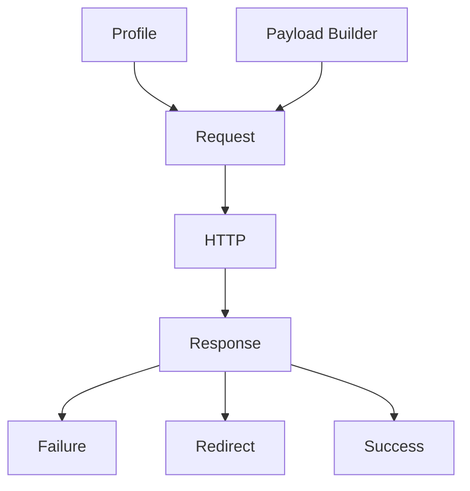
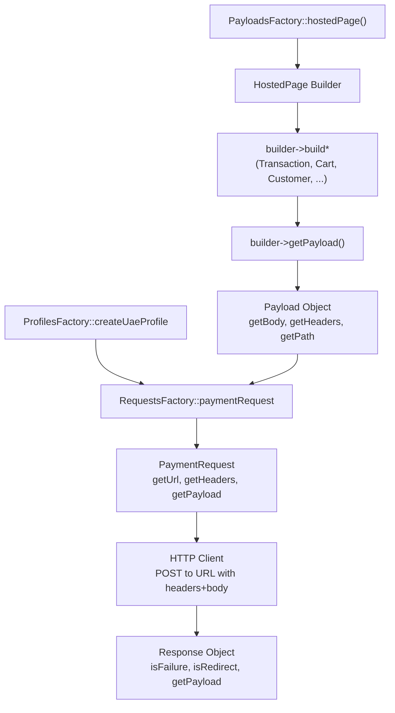

# PayTabs PHP SDK - Architecture Overview

This document explains the SDK architecture for developers integrating with the PayTabs payment gateway. Think of the SDK as Lego blocks:

- Small Parts (atomic pieces) form Payloads (assembled components).
- Profiles are another group of Parts that represent authentication & endpoint context.
- Profile + Payload + destination path/type = Request (a constructed Lego model ready to send).
- Responses are mapped back into typed Payload objects (direct or webhook), and are classified as Failure, Redirect, or Known success payloads.

This file covers the main building blocks and provides diagrams and a quick runnable sample.

## Main Concepts

- `PartInterface` - the atomic building block. Each part implements `build(): array` and returns a fragment that fits into headers, body, query or path.
- `Payload` (`AbstractPayload`) - collects Parts and exposes `getBody()`, `getHeaders()`, `getQuery()`, `getPath()`; used to compose the HTTP request body and other sections.
- `Profile` - a specialized payload containing endpoint, credentials, and server-level headers/body.
- `Request` (`AbstractRequest`) - combines a `Profile` and a `Payload` (via a builder) into a ready-to-send HTTP request with `getUrl()`, `getHeaders()`, `getPayload()`.
- `Response` - two main branches: Direct (synchronous HTTP responses) and Webhook (asynchronous IPN/callbacks). Responses are mapped into typed payload objects.

## Files of Interest

- `src/Request/Payload/PartInterface.php`
- `src/Request/Payload/AbstractPayload.php`
- `src/Profile/Profile.php`
- `src/Request/RequestsFactory.php`
- `src/Request/Payload/PayloadsFactory.php`

## Quick Flow (Text)

1. Developer builds a `Profile` with `ProfilesFactory::createUaeProfile(...)` (endpoint + credentials).
2. Developer creates a request builder via `PayloadsFactory::ownForm()` (or `managedForm()`, `hostedPage()`, ...).
3. The builder adds Parts: transaction, cart, customer details, URLs, etc.
4. Developer creates a request via `RequestsFactory::paymentRequest($profile, $builder)`.
5. Call `getUrl()`, `getHeaders()`, `getPayload()` to send the HTTP call using any HTTP client.
6. Map the raw HTTP response into a `Response` object and inspect `isFailure()`, `isRedirect()`, or mapped payload values.

## ASCII Diagram

```
Profile + Payload -> Request -> HTTP -> Response

  [Profile]      [Payload Builder]
     |                |
     +------(merge)---+
              |
          [Request]
              |
           HTTP CALL
              |
          [Response]
             / \
         Failure Redirect/Success
```

## Mermaid Diagram (Rendered on GitHub)



## PlantUML Source

See `docs/diagrams/flow.puml` for PlantUML source to generate PNG/SVG.

## Quick Example

1. Create a profile: `ProfilesFactory::createUaeProfile(123, 'server_key')`
2. Create builder: `PayloadsFactory::ownForm()`
3. Add parts: `buildTransaction()`, `buildCart()`, `buildURLs()`
4. Compose request: `RequestsFactory::paymentRequest($profile, $builder)`
5. Print `getUrl()`, `getHeaders()`, `getPayload()` (sample prints them - it does not make a network call)

See `Samples/IntegrationExample.php` for a runnable sample.

---

## PaymentRequest in Detail

The `PaymentRequest` is the most common request type. It uses a `HostedPage` (or `OwnForm`, `ManagedForm`) payload, which accepts many optional `Part` objects.

### Available Parts for PaymentRequest

- **Cart** - transaction amount, currency, cart ID, description
- **Transaction** - transaction type (Sale, Auth, Capture) and class (Ecom, Moto, Recurring)
- **CustomerDetails** - buyer name, phone, email, full address
- **ShippingDetails** - shipping recipient name and address
- **URLs** - return and callback URLs for post-payment flow
- **ConfigId** - profile configuration override
- **PaymentMethods** - include/exclude payment options (card, e-wallet, etc.)
- **CardFilter** - restrict by card BIN patterns
- **CardDiscounts** - apply discounts per card range
- **Tokenise** / **TokeniseEnhanced** - enable recurring payments and token storage
- **UserDefined** - custom fields (UDF1-UDF9)
- **Invoice** - line items, charges, invoice dates (for hosted invoices)
- **PluginInfo** - platform and plugin version metadata

Diagram: See `docs/diagrams/payment-request-composition.mmd` for composition flow.

See `docs/diagrams/payment-parts-reference.mmd` for a parts reference map.

### Code Example: Full PaymentRequest

```php
use Paytabs\Sdk\Profile\ProfilesFactory;
use Paytabs\Sdk\Request\Payload\PayloadsFactory;
use Paytabs\Sdk\Request\RequestsFactory;
use Paytabs\Sdk\Enums\TranType;
use Paytabs\Sdk\Enums\TranClass;
use Paytabs\Sdk\Request\Payload\Parts\CustomerDetails;
use Paytabs\Sdk\Request\Payload\Parts\CardDiscounts;
use Paytabs\Sdk\Request\Payload\Parts\Partials\CardDiscount;
use Paytabs\Sdk\Enums\CardDiscountType;

// 1) Create profile for UAE
$profile = ProfilesFactory::createUaeProfile(123, 'server_key');

// 2) Create builder (HostedPage, OwnForm, ManagedForm, etc.)
$builder = PayloadsFactory::hostedPage();

// 3) Add parts (builder methods return $this for chaining)
$builder
    ->buildTransaction(TranType::Sale, TranClass::Ecom)
    ->buildCart('cart-001', 'USD', 99.99, 'Purchase Order')
    ->buildCustomerDetails(
        (new CustomerDetails('John Doe', '1234567890', 'john@example.com'))
            ->setAddress('AE', 'Dubai', 'Dubai', 'Main St', '12345')
    )
    ->buildShippingDetails(new ShippingDetails('John Doe'))
    ->buildURLs('https://example.com/return', 'https://example.com/callback')
    ->buildCardDiscounts(
        new CardDiscounts(
            new CardDiscount(CardDiscountType::Fixed, 10.0, '4111', '10 AED off on Visa')
        )
    )
    ->buildUserDefined(
        (new UserDefined())->setUDF1('custom_field_1')->setUDF2('custom_field_2')
    )
    ->buildTokenise(true) // Enable token storage
;

// 4) Create request
$request = RequestsFactory::paymentRequest($profile, $builder);

// 5) Send (example with GuzzleHttp or any HTTP client)
$httpClient = new GuzzleHttp\Client();
$httpResponse = $httpClient->request(
    $request->getHttpType()->value,
    $request->getUrl(),
    [
        'headers' => $request->getHeaders(),
        'body'    => $request->getPayload(),
    ]
);

// 6) Handle response
$payloadClass = $request->getResponseClass();
$response = /* map raw response to Response object */;

if ($response->isFailure()) {
    echo 'Error: ' . $response->getFailure()->getMessage();
} elseif ($response->isRedirect()) {
    header('Location: ' . $response->getRedirect()->getRedirectUrl());
} else {
    $payload = $response->getPayload()->getMapped();
    echo 'Success: ' . $payload->getTransactionRef();
}
```

See `Samples/PaymentRequest.php` for a complete working example with all features.

### Request Flow Diagram

Sequence from creating the builder to sending the HTTP request:



See `docs/diagrams/payment-request-flow.puml` for the full PlantUML sequence diagram.

## Maintainer Notes

- Diagrams: update `docs/diagrams/flow.mmd` (Mermaid) and `docs/diagrams/flow.puml` (PlantUML) when the flow changes.
- Add new PaymentRequest diagrams in `docs/diagrams/` when adding new Features.
- Samples: put quick integration examples in `Samples/` and heavy, interactive examples in `examples/`.
